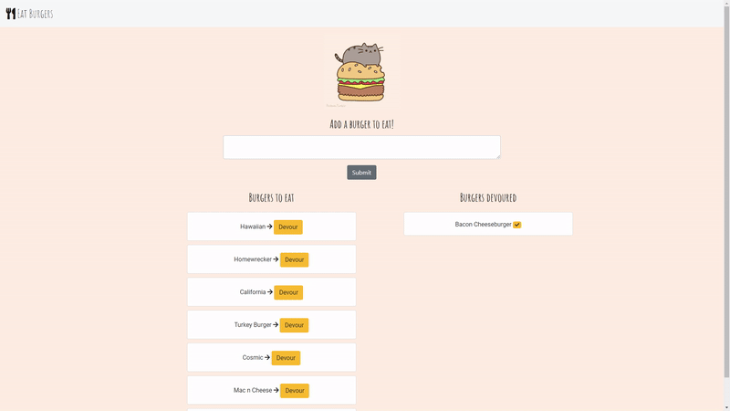

# Devour It

This web app is a simple interface for users to enter burgers they would like to eat, and then "eat" them by clicking a button. This app is structured using the MVC framework. It utilizes the following technologies:

| Technology      | Usage        |
| ------------- |-------------|
| Node.js  | Used to create the server-side of this application. It provides the ability to link with node modules as well. |
| Express    | Handles all of our routing requests.     |
| Handlebars | Display HTML to the page and render data from the server. | 
| Bootstrap | Format HTML cleanly with mobile-responsiveness. |
| Font Awesome | Add nice icons to the page. |
| JQuery | Listen for button clicks and grab values from the HTML.  | 
| MySQL | Store the burgers that the user enters, and handle additions and updates to those burgers. | 
| Heroku | Host the app online for free.  | 
| Jaws DB | Host our database online for free so we can connect with Heroku.  |

## How It Works

* Using Handlebars, the home page loops through everything in the database and displays each burger in the appropriate column (depending on whether or not it has been devoured).
* Users can type in a burger of their choice in the input box. If the input is left blank, the app will display helper text to tell the user to enter a burger. 
* When the submit button is clicked, the app creates a new row in the database with the burger's information. The page reloads to show the new burger.
* Users can devour a burger of their choice with the Devour button next to each burger. This button triggers an update function in the database to change the burger to "devoured." The page reloads and the burger will be sorted into the appropriate column.

## Example of Usage

 